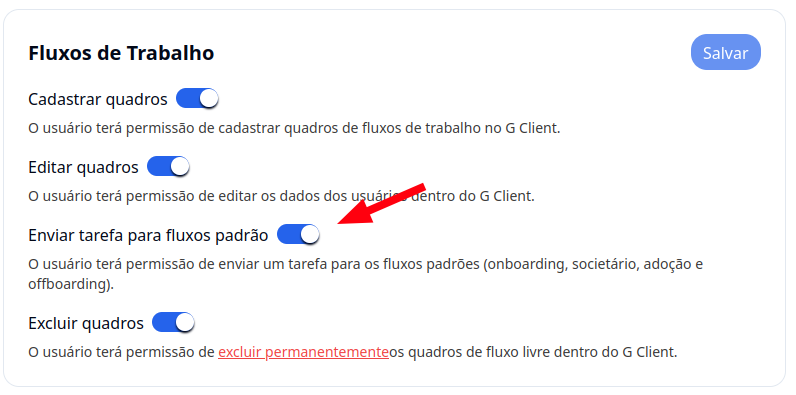
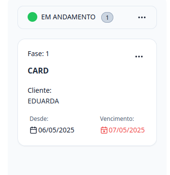
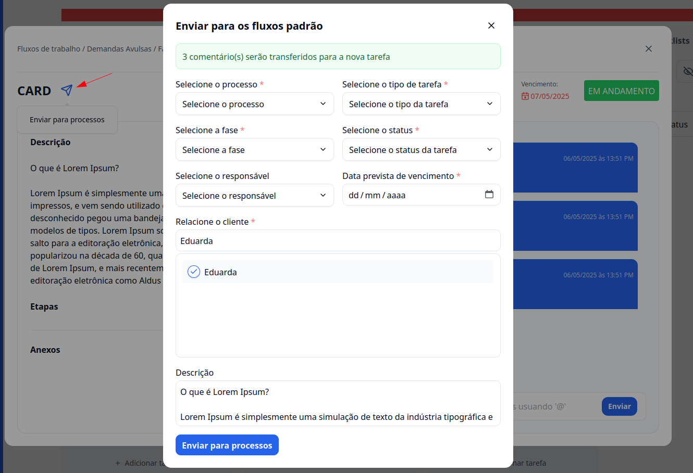

## Introdução

Bem-vindo ao tutorial do **G Client**! Neste guia, explicaremos como enviar uma tarefa dos **Fluxos de Trabalho** para os **Fluxos Padrões** (Onboarding, Adoção, Societário e Offboarding).

---

## Passo a passo para enviar tarefa para os fluxos padrões

### 1. Acesse o G Client

Primeiramente, faça login na sua conta do **G Client** e certifique-se de que possui permissão para enviar tarefas para os fluxos padrões.

---

### 2. Navegue até a seção **Fluxos de Trabalho**

Na página principal, clique na aba **Quadros**, localizada no menu lateral. Isso abrirá todos os status e tarefas do quadro selecionado. Em seguida, clique na tarefa que deseja enviar para os fluxos padrões.

---

### 3. Dentro da tarefa

Você poderá visualizar as informações da tarefa. Ao lado do nome, haverá um ícone de envio. Clique nele.

Será aberto um formulário com os seguintes campos:

- **Processo**, **Tipo de tarefa**, **Fase**, **Status**, **Data prevista de vencimento**, **Cliente** (campos obrigatórios)
- **Responsável**, **Descrição** (opcional)

> 📝 Os **comentários** e **anexos** serão puxados automaticamente. A **descrição** também será copiada, mas você poderá editá-la como preferir.

Após preencher os campos, clique em **Enviar para processos**.

---

✅ **Pronto!** Agora você sabe como enviar tarefas dos **Fluxos de Trabalho** para os **Fluxos Padrões**. Se precisar de ajuda, entre em contato clicando [aqui](https://api.whatsapp.com/send?phone=5544997046569&text=Preciso%20de%20ajuda%20sobre%20um%20tutorial)!

🎉 **Obrigado por usar o G Client!**
