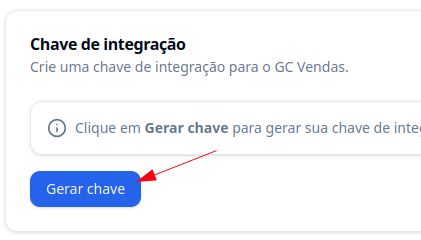
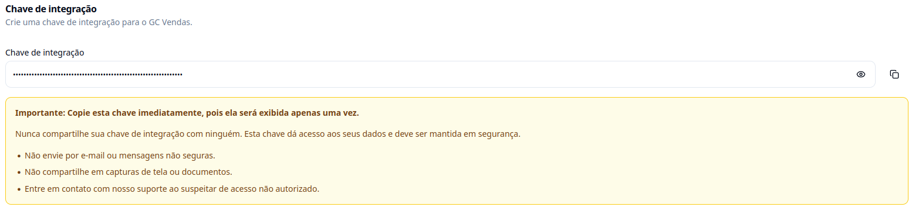
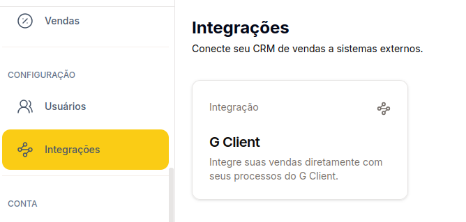
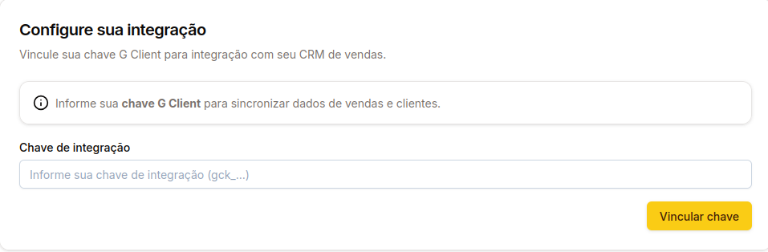

## Introdução

Esse tutorial é para você que é usuário do **GC Vendas**, nosso CRM de vendas voltado para contadores. Aqui você vai aprender a fazer a integração entre o GC Vendas e o **G Client** de forma fácil e objetiva.

---

## Passo a passo para integrar o GC Vendas com o G Client

### 1. Acesse o G Client

Faça login na sua conta do **G Client**.

---

### 2. Acesse a página de configurações

No menu lateral, role até o final e clique na opção **Configurações** (ícone de engrenagem). Em seguida, localize a seção **Integrações** e clique em **GC Vendas**.

---

### 3. Gerar o código de integração

Nesta página, você poderá gerar a chave de integração responsável por conectar os dois sistemas. Clique em **Gerar Chave**.

- A chave gerada terá o seguinte formato: `gck_xxxxxxxxxxxxxxxxxxxxxxxx`

> ⚠️ **Importante:** Não compartilhe essa chave com ninguém. Ela permite acesso às suas informações no G Client.

---

### 4. Conectar os sistemas

Com a chave gerada, vá até o **GC Vendas**. Estando logado, acesse as configurações e clique em **Integrações**. Em seguida, selecione a opção **G Client**.

Cole a chave no campo **Chave de Integração** e clique em **Vincular Chave**.

---

✅ **Pronto!** Agora você concluiu a integração do **GC Vendas** com o **G Client**. Se precisar de ajuda, entre em contato clicando [aqui](https://api.whatsapp.com/send?phone=5544997046569&text=Preciso%20de%20ajuda%20sobre%20um%20tutorial)!

🎉 **Obrigado por usar o G Client!**
