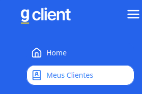
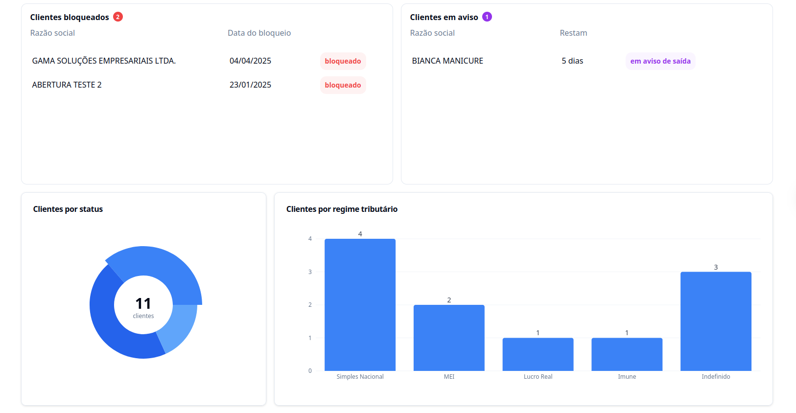
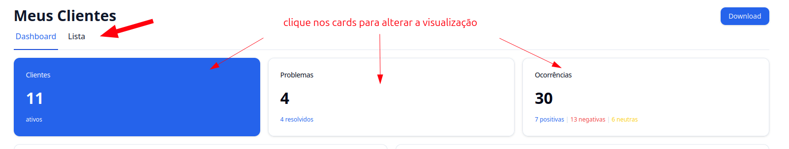

## Introdução

Agora, dentro do **G Client**, você pode visualizar apenas os clientes que estão relacionados a você.

---

## Passo a passo para acessar a página

### 1. Acesse o G Client

Primeiramente, faça login na sua conta do **G Client**.

---

### 2. Localize a página

No menu lateral, logo abaixo da opção **Home**, você encontrará a opção **Meus Clientes**.

---

### 3. Entendendo a página

Nesta página, você poderá visualizar:

- Os clientes pelos quais você é responsável;
- Clientes com status de **bloqueado** ou em **aviso de saída**;
- Distribuição dos clientes por **status** e por **regime tributário**;
- Lista completa dos seus clientes.

Você também pode alternar entre as visualizações de **Clientes**, **Problemas** e **Ocorrências** clicando nos cards no topo da página. O card selecionado estará destacado em azul.

---

### 4. Exportando os dados

Caso deseje exportar as informações, basta selecionar os dados desejados e clicar no botão **Download** para gerar o arquivo em PDF.

---

✅ **Pronto!** Agora você sabe como acessar e utilizar a página **Meus Clientes** dentro do **G Client**. Se precisar de ajuda, entre em contato clicando [aqui](https://api.whatsapp.com/send?phone=5544997046569&text=Preciso%20de%20ajuda%20sobre%20um%20tutorial)!

🎉 **Obrigado por usar o G Client!**
