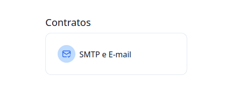
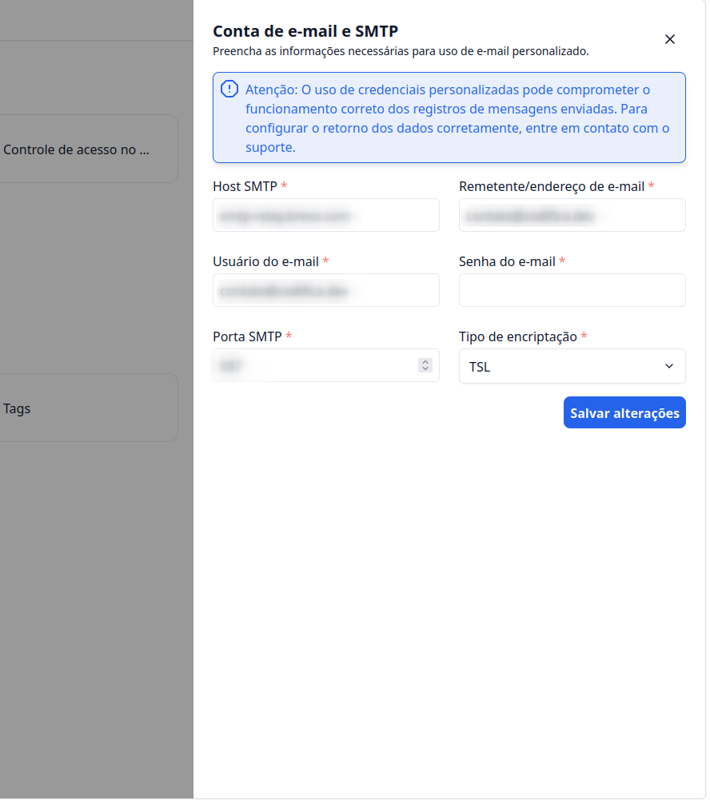

## Introdução

Bem-vindo ao tutorial do **G Client**! Neste guia, vamos ensinar como personalizar o e-mail para envio de solicitações de contratos.

---

## Passo a Passo para Personalizar o E-mail de Solicitação de Contratos

### 1. Acesse o G Client

Faça login na sua conta do **G Client**.

---

### 2. Acesse a Página de Configurações

No menu lateral, role até o final e clique na opção de **Configurações**, representada pelo ícone de engrenagem.

---

### 3. Vá para a Seção **Contratos**

Na página de configurações, localize a seção **Contratos** e selecione a opção **SMTP e E-mail**.

---

### 4. Preencha as Informações

No modal que será aberto, insira as informações solicitadas:

- **Host SMTP**: informe o endereço do seu provedor de SMTP.
- **Remetente/Endereço de E-mail**: o e-mail que enviará as solicitações.
- **Usuário do E-mail**: geralmente o mesmo endereço de e-mail.
- **Senha do E-mail**: a senha vinculada ao e-mail ou gerada pelo provedor.
- **Porta SMTP**: fornecida pelo seu provedor de SMTP.
- **Tipo de Encriptação**: escolha conforme as orientações do seu provedor (TLS ou SSL, por exemplo).

> ℹ️ **Dica**: Use um provedor confiável para configurar o SMTP.

Após preencher todos os campos, clique em **Salvar Alterações**.

---

✅ **Pronto!** Agora você pode enviar e-mails personalizados para contratos no **G Client**. Se precisar de ajuda, entre em contato clicando [aqui](https://api.whatsapp.com/send?phone=5544997046569&text=Preciso%20de%20ajuda%20sobre%20um%20tutorial)!

🎉 **Obrigado por usar o G Client!**
