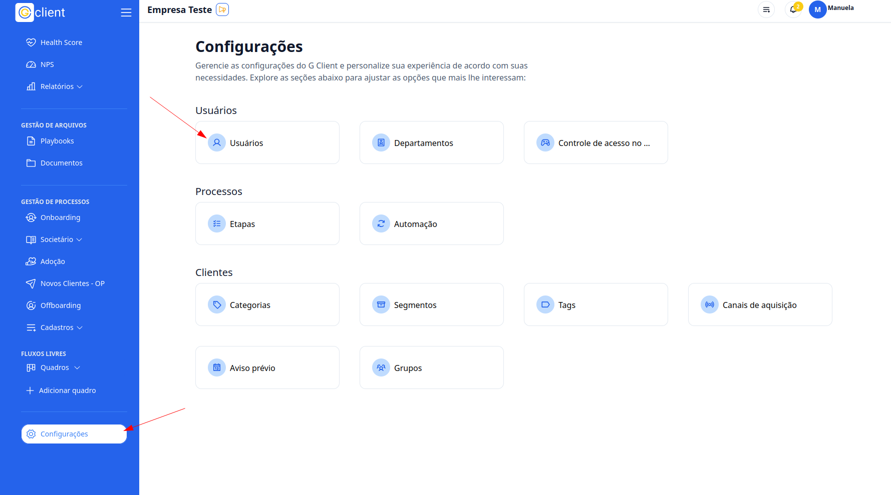
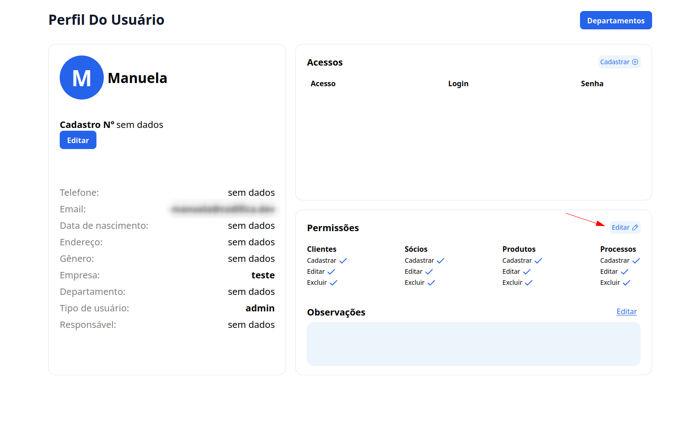
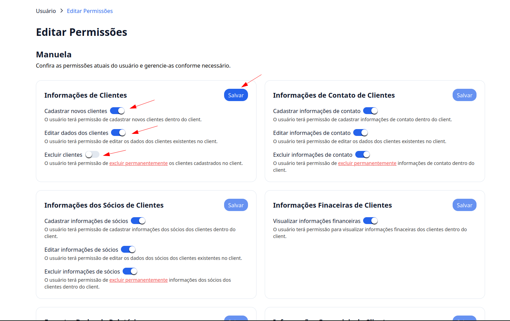

## Passo a Passo de Como Definir Permissões para Usuários

### 1. Acesse o G Client

Primeiro, faça login na sua conta do **G Client**.

---

### 2. Acesse a Página de Configurações

Navegue até o final da barra lateral e clique no ícone de **Engrenagem** para acessar a página de configurações. Em seguida, clique em **Usuários** para visualizar a lista de usuários.

---

### 3. Permissões

Na seção de permissões, localize o usuário desejado e clique em **Editar**.

---

### 4. Editar Permissões

No painel de edição, configure as permissões conforme necessário para o usuário. Após finalizar as alterações, clique em **Salvar** para aplicar as mudanças.

---

✅ **Pronto!** Agora você pode definir e editar permissões para os usuários no **G Client** de forma simples e eficiente. Se precisar de ajuda, entre em contato clicando [aqui](https://api.whatsapp.com/send?phone=5544997046569&text=Preciso%20de%20ajuda%20sobre%20um%20tutorial)!

🎉 **Obrigado por usar o G Client!**
