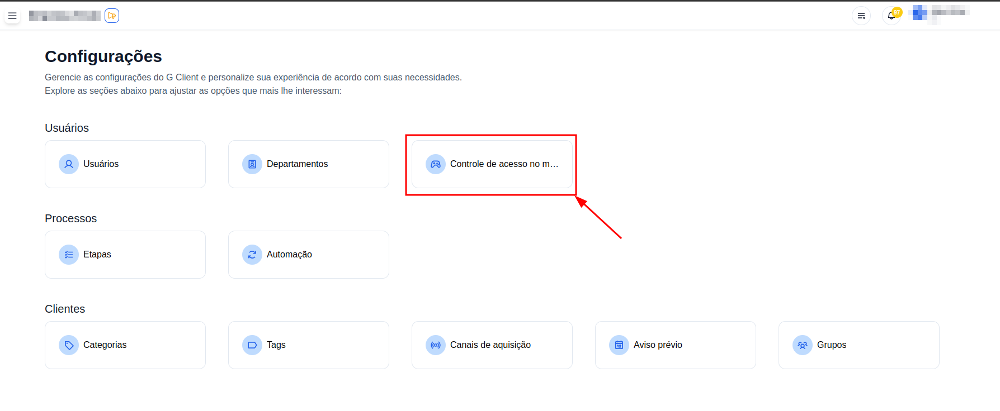
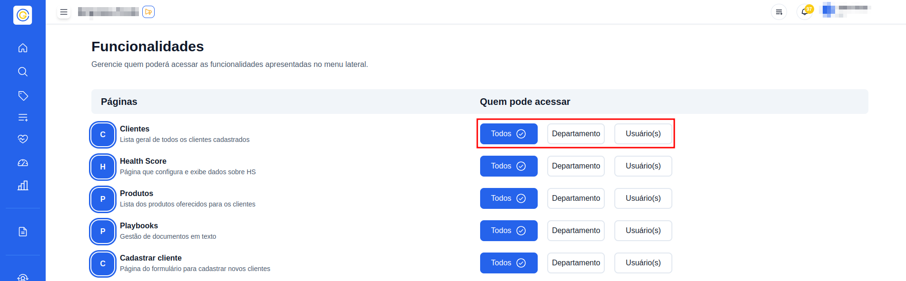
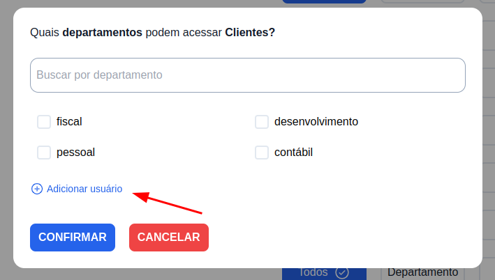

## Introdução

Bem-vindo ao tutorial do G Client! Neste guia, vamos explicar como você pode controlar quais páginas e itens no menu do G Client os usuários da sua empresa podem acessar.

---

## Quem pode editar o acesso aos itens do menu?

Usuários com a permissão **Controle das configurações de Acesso no Menu** poderão acessar a página de configuração do acesso ao menu e editar quem pode acessar cada item.

---

## Passo a Passo para Editar o Acesso aos Itens do Menu

### 1. Acesse o G Client

Primeiro, faça login na sua conta do G Client.

---

### 2. Acesse a Página de Configurações

Navegue até o final da barra lateral e acesse a página de configurações, simbolizada pelo ícone de uma engrenagem.

---

### 3. Acesse a Página de Controle de Acesso ao Menu

Na página de configurações, selecione a opção **Controle de Acesso no Menu** para acessar a página de configuração do controle de acesso ao menu.

---

### 4. Identifique os Itens que Você Deseja Configurar e Selecione uma das Opções

Você pode optar por:

- Deixar o item disponível para todos os usuários e departamentos.
- Selecionar departamentos e/ou usuários específicos para acesso.

---

### 5. Selecione os Usuários e/ou Departamentos que Deseja Permitir

Caso você queira que apenas alguns departamentos e/ou usuários possam acessar o item do menu:

1. Abra o modal.
2. Selecione os departamentos ou usuários desejados.
3. No modal de departamentos, você pode adicionar usuários para garantir acesso clicando no botão **Adicionar Usuário**.

---

### 6. Pressione Confirmar Após Selecionar os Usuários e/ou Departamentos

Após definir as configurações:

1. Clique em **Confirmar** para salvar as alterações.
2. Lembre-se de que os usuários precisarão recarregar a página do G Client (se conectados) para que as alterações sejam visíveis.

---

## Conclusão

A funcionalidade de **Controle de Acesso ao Menu** é uma ferramenta poderosa para limitar o acesso a informações específicas no G Client. Utilize essa funcionalidade para gerenciar com eficiência quem pode visualizar e acessar determinados itens no menu da sua empresa.

✅ **Pronto!** Agora você sabe como configurar o controle de acesso ao menu no **G Client**. Se precisar de ajuda, entre em contato clicando [aqui](https://api.whatsapp.com/send?phone=5544997046569&text=Preciso%20de%20ajuda%20sobre%20um%20tutorial)!

🎉 **Obrigado por usar o G Client!**
