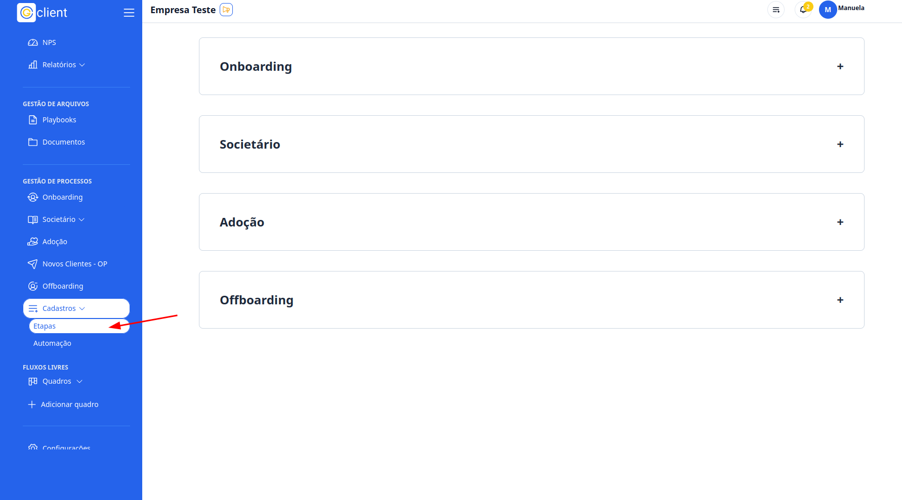
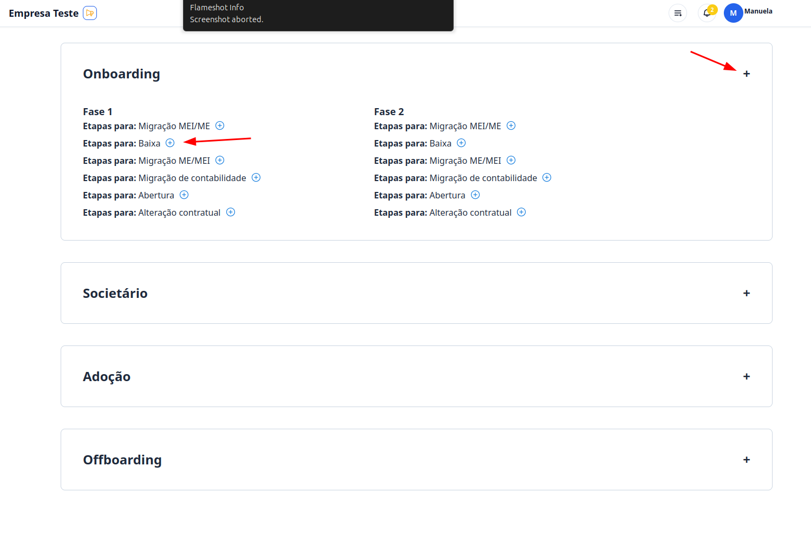
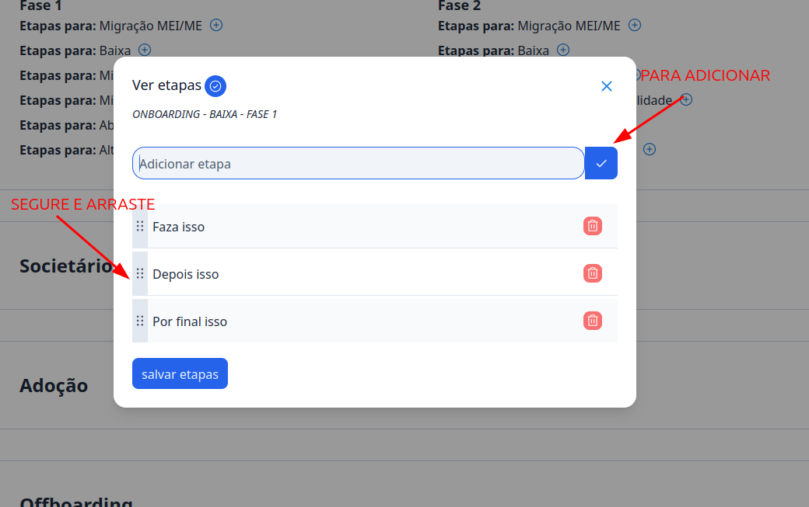

## Passo a Passo de Como Criar Checklist Padrão

### 1. Acesse o G Client

Primeiramente, faça login na sua conta do **G Client**. Certifique-se de que você tem permissão para criar checklist padrão.

---

### 2. Navegue até a Seção **Gestão de Processos**

Clique na aba **Cadastros**, localizada ao final do menu lateral. Escolha a opção **Etapas**.

---

### 3. Escolha o Processo

Selecione o processo para o qual deseja criar os checklists automáticos.

Dentro do processo escolhido, você verá as etapas. Clique no botão `➕` na etapa onde deseja adicionar o checklist.

---

### 4. Cadastre os Checklists

Ao clicar para adicionar o checklist, será exibido um modal. Preencha as etapas que deseja cadastrar e clique no botão de ✅ para adicionar cada item.

Você pode organizar a ordem dos itens adicionados arrastando-os pela barra lateral exibida ao lado de cada item.

Para finalizar, clique em **Salvar Etapas**.

---

✅ **Pronto!** Agora você pode criar checklists padrão para os processos de entrada de clientes de forma prática e eficiente no **G Client**. Se precisar de ajuda, entre em contato clicando [aqui](https://api.whatsapp.com/send?phone=5544997046569&text=Preciso%20de%20ajuda%20sobre%20um%20tutorial)!

🎉 **Obrigado por usar o G Client!**
