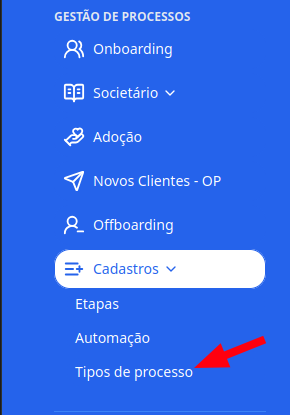
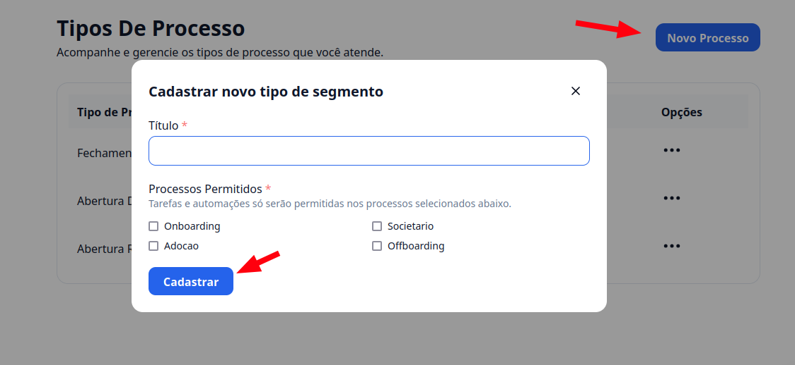
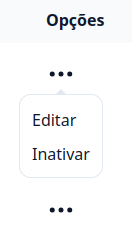

## Introdução

Agora você pode deixar o **G Client** com a sua cara, criando novos tipos de processos personalizados para sua operação.

---

## Passo a passo para criar um tipo de processo

### 1. Acesse o G Client

Primeiramente, faça login na sua conta do **G Client**. Certifique-se de que você tem permissão para criar um novo tipo de processo.

---

### 2. Navegue até a seção **Gestão de Processos**

Clique em **Cadastros** e selecione a opção **Tipos de processo**.

---

### 3. Criando o novo tipo de processo

Para criar um novo tipo, clique no botão **Novo Processo**, localizado no canto superior direito da tela. Você deverá preencher os seguintes campos:

- **Título**: o nome do novo tipo de processo.
- **Processos Permitidos**: em quais áreas será permitido utilizar esse tipo de processo (Onboarding, Societário, Adoção e Offboarding).

Depois de preencher tudo, clique em **Cadastrar** para finalizar a criação.

---

### 4. Ações disponíveis para tipos de processo já criados

Você pode editar os tipos de processo existentes clicando no botão de opções (**...**) ao lado de cada item e, em seguida, em **Editar**. Será possível alterar:

- **Título**
- **Processos Permitidos**

Também é possível inativar um tipo de processo, caso ele não seja mais utilizado.

---

✅ **Pronto!** Agora você sabe como criar um tipo de processo no **G Client**. Se precisar de ajuda, entre em contato clicando [aqui](https://api.whatsapp.com/send?phone=5544997046569&text=Preciso%20de%20ajuda%20sobre%20um%20tutorial)!

🎉 **Obrigado por usar o G Client!**
