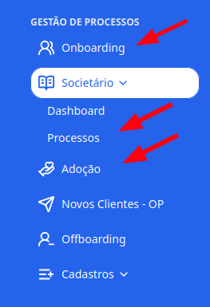
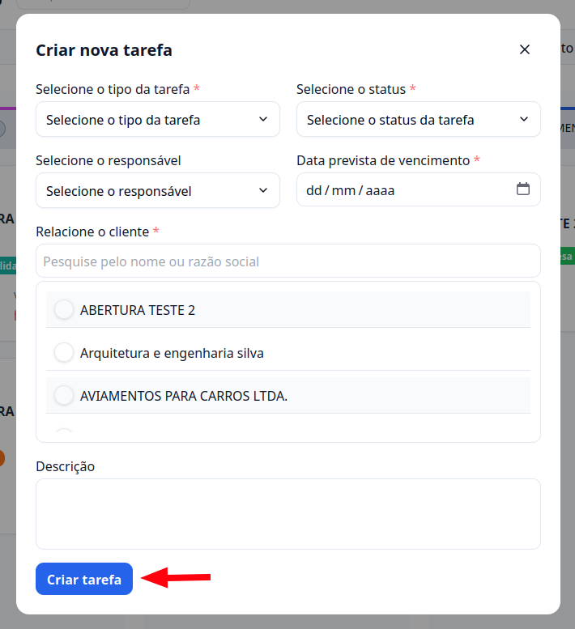

## Introdução

Vamos aprender como criar uma nova tarefa dentro dos processos no **G Client**.

---

## Passo a passo para criar um novo processo

### 1. Acesse o G Client

Primeiramente, faça login na sua conta do **G Client**. Certifique-se de que você tem permissão para criar um novo processo.

---

### 2. Navegue até a seção **Gestão de Processos**

Clique em uma das opções: **Onboarding**, **Societário** ou **Adoção**. Em seguida, clique no botão **Criar nova +**.

---

### 3. Preencha os campos

Você terá os seguintes campos para preencher:

- **Tipo da tarefa** (obrigatório)
- **Status** (obrigatório)
- **Responsável**
- **Data prevista de vencimento** (obrigatório)
- **Cliente relacionado** (obrigatório)
- **Descrição**

> ℹ️ Sempre que a razão social do cliente for atualizada, o nome do card será automaticamente alterado!

Depois de preencher os campos, clique em **Criar tarefa**.

---

✅ **Pronto!** Agora você sabe como criar uma tarefa nos processos do **G Client**. Se precisar de ajuda, entre em contato clicando [aqui](https://api.whatsapp.com/send?phone=5544997046569&text=Preciso%20de%20ajuda%20sobre%20um%20tutorial)!

🎉 **Obrigado por usar o G Client!**
