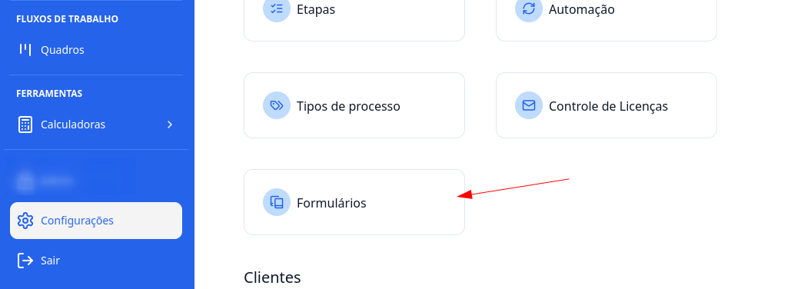
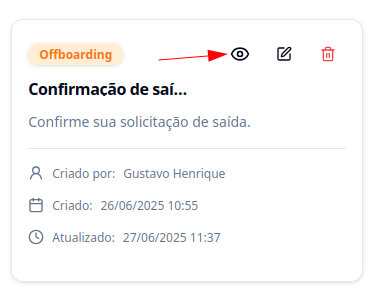
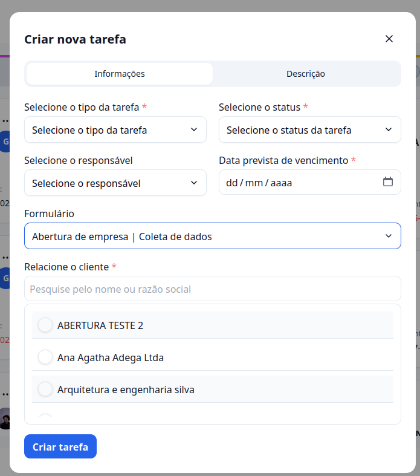
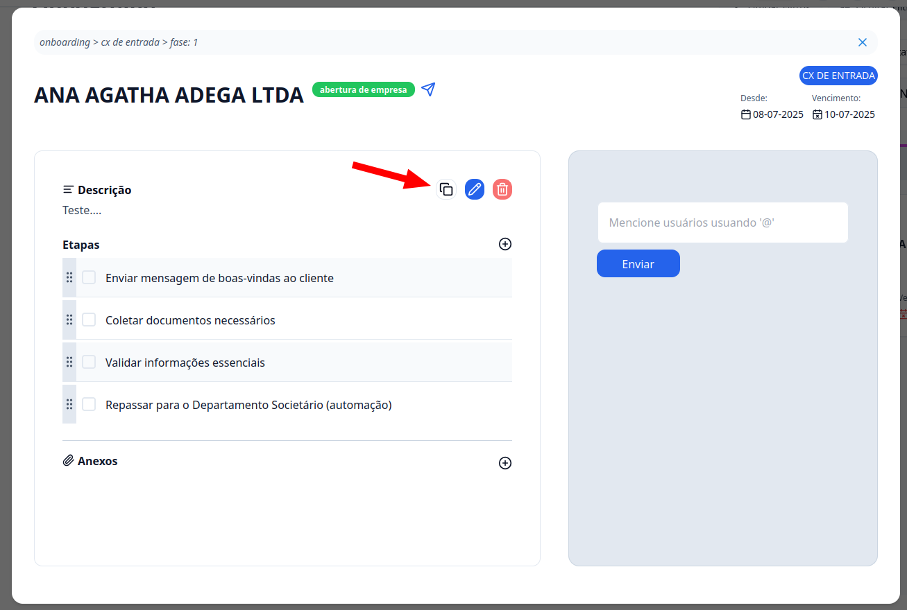

## Introdução

Venha aprender como criar e enviar formulários para captura de **documentos e dados dos seus clientes** dentro do **G Client**.

---

## Passo a passo

### 1. Crie um novo formulário

Acesse o menu: **Configurações** > **Processos** > **Formulários**.

Você poderá visualizar, editar ou criar um novo formulário. Para criar, clique em **+ Novo Formulário**, no canto superior direito. Em seguida, preencha as seguintes informações:

- **Nome do formulário**
- **Tipo de processo** (Onboarding, Societário, Adoção, Offboarding)
- **Descrição**
- **Campos do formulário**

Você pode configurar os campos de acordo com a necessidade: definir se são obrigatórios, tipo de campo (texto, múltipla escolha, seleção, etc).

Após finalizar, clique em **Cadastrar**.

Para visualizar como o formulário ficará, clique no ícone de **olho**.

Para editar, clique no ícone de **edição**. O processo é o mesmo da criação. Caso o formulário não seja mais necessário, você pode excluí-lo.

---

### 2. Utilizando o formulário

Após criado, o formulário pode ser **vinculado a uma tarefa** nos processos: **Onboarding**, **Offboarding**, **Societário** ou **Adoção**. Isso pode ser feito durante a criação da tarefa ou ao editá-la.

Depois de vincular, você pode **copiar o link do formulário** e **enviar para o seu cliente**.

Assim que o cliente preencher o formulário, os dados serão exibidos automaticamente na descrição da tarefa.

---

✅ **Pronto!** Agora você sabe como utilizar os formulários do **G Client**.  
Se precisar de ajuda, entre em contato clicando [aqui](https://api.whatsapp.com/send?phone=5544997046569&text=Preciso%20de%20ajuda%20sobre%20um%20tutorial)!

🎉 **Obrigado por usar o G Client!**
