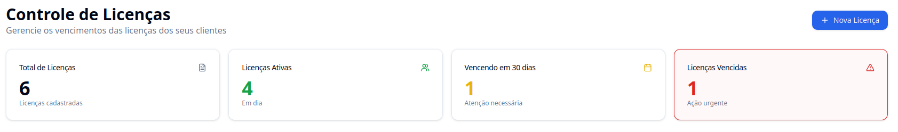
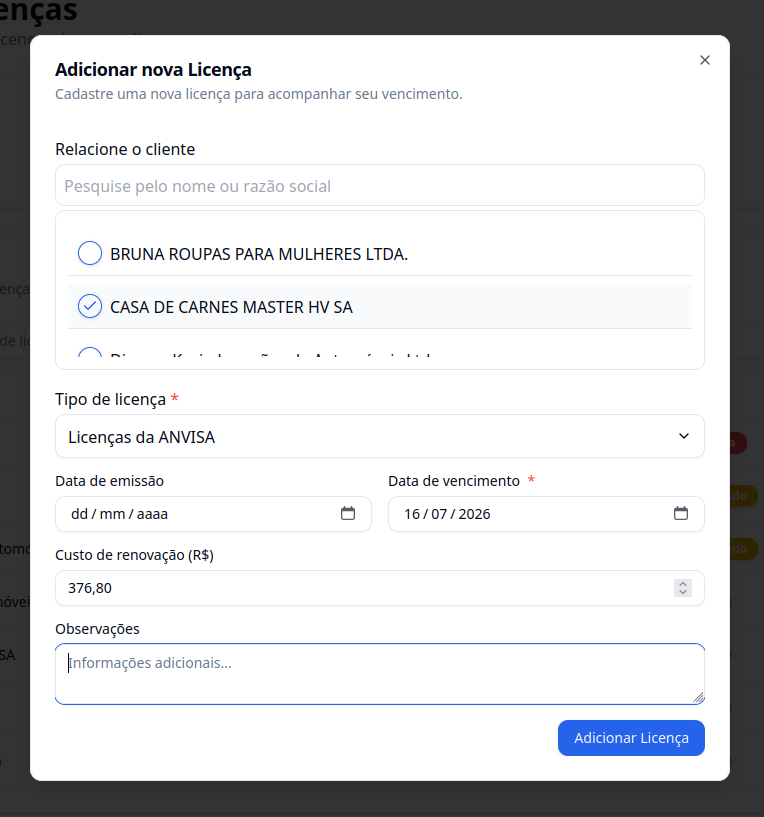
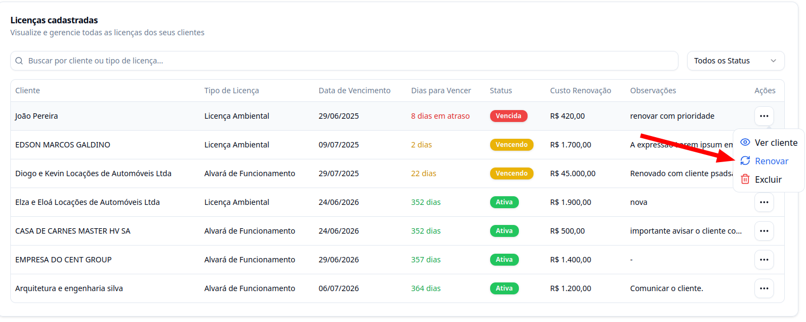
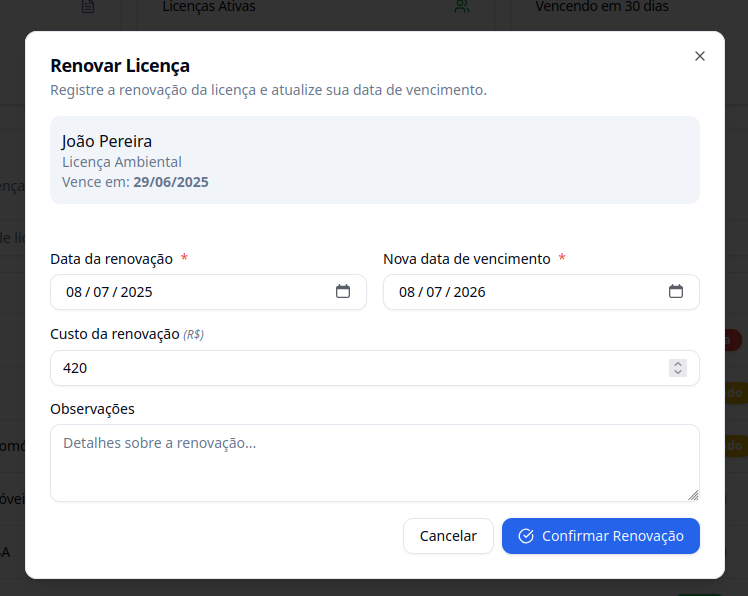
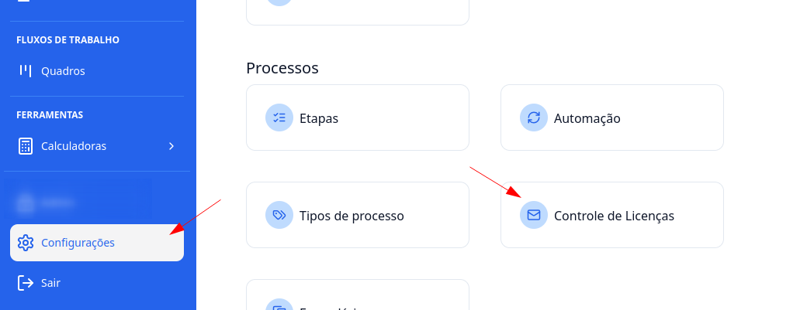

## Introdução

Vamos aprender como funciona o controle de licenças no **G Client** e como cadastrar, renovar e receber notificações de vencimento.

---

## 1. Acesse o G Client

Primeiramente, faça login na sua conta do **G Client**. Certifique-se de que você possui a permissão **Controle de Licenças**.

---

## 2. Navegue até a seção **Gestão de Processos**

Clique em **Societário** > **Controle de Licenças**.

---

## 3. Entendendo a página

Você verá todas as licenças cadastradas, separadas em:

- **Ativas**
- **Para vencer em até 30 dias**
- **Vencidas**

As cores ajudam na visualização:

- ✅ **Verde**: Ativas  
- ⚠️ **Amarelo**: Para vencer  
- ❌ **Vermelho**: Vencidas

---

## Cadastrar uma nova licença

Na página de **Controle de Licenças**, clique no botão **Nova Licença** no canto superior direito. Será exibido um formulário com os seguintes campos:

- **Obrigatórios**: Cliente, Tipo de licença, Data de vencimento  
- **Opcionais**: Data de emissão, Custo da renovação, Observações

Após preencher, clique em **Adicionar Licença**.

---

## Renovar uma licença

Você pode renovar uma licença existente sem precisar criar uma nova.

Preencha os campos:

- **Obrigatórios**: Data da renovação, Nova data de vencimento  
- **Opcionais**: Custo da renovação, Observações

Depois, clique em **Confirmar Renovação**.

---

## Receber e-mails de aviso sobre vencimento

Você pode configurar o envio de notificações por e-mail para quando a licença estiver a **30 dias do vencimento**.

Para isso, vá em:  
**Configurações** > **Processos** > **Controle de Licenças**

Adicione o e-mail que deve receber os avisos.  
> O e-mail não precisa ser de um usuário do G Client, pode ser qualquer endereço.

---

### Como funcionam as notificações?

- Os e-mails são enviados todo dia **1º de cada mês**
- Apenas licenças com vencimento no **mês atual** são incluídas
- Todos os e-mails configurados recebem a mesma notificação
- As notificações são enviadas automaticamente às **9:00 da manhã**

---

✅ **Pronto!** Agora você sabe como utilizar o controle de licenças no **G Client**.  
Se precisar de ajuda, entre em contato clicando [aqui](https://api.whatsapp.com/send?phone=5544997046569&text=Preciso%20de%20ajuda%20sobre%20um%20tutorial)!

🎉 **Obrigado por usar o G Client!**
