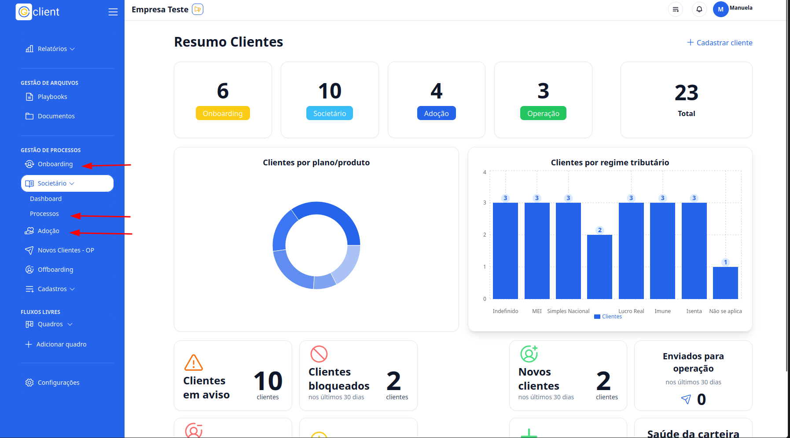
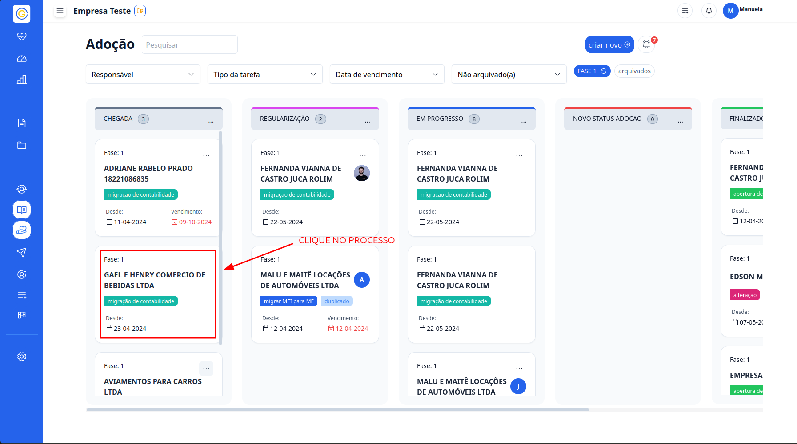
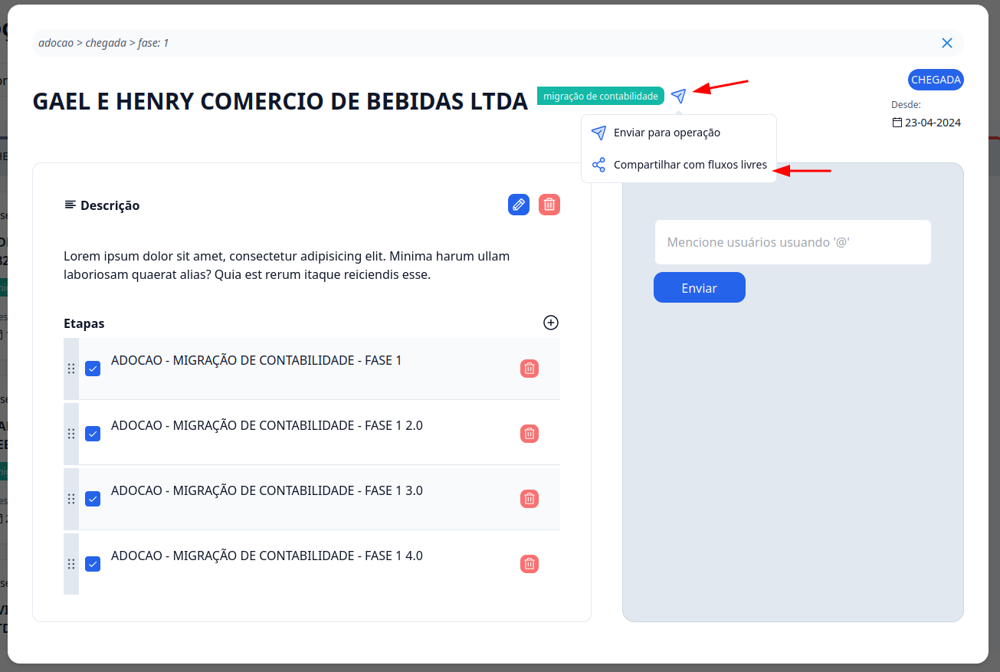
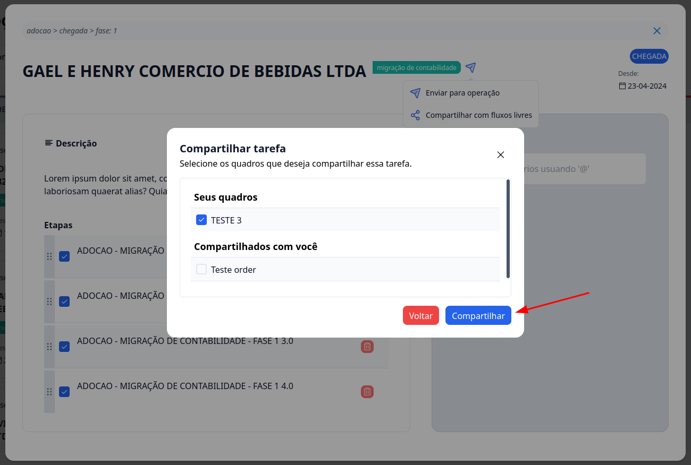

## Passo a Passo de Como Compartilhar Tarefa do Processo de Entrada para um Quadro Personalizado

### 1. Acesse o G Client

Primeiramente, faça login na sua conta do **G Client**.

---

### 2. Navegue até a Seção de **Gestão de Processos**

Clique em uma das opções: **Onboarding**, **Societário** ou **Adoção**.

---

### 3. Escolha o Processo

Dentro das opções **Onboarding**, **Societário** ou **Adoção**, escolha o processo que você deseja compartilhar e clique nele.

---

### 4. Compartilhe o Processo

Ao lado do título do processo, haverá um ícone azul. Clique nele e escolha a opção **Compartilhar com fluxos de trabalho**.

---

### 5. Escolha o Quadro

Assim que clicar em **Compartilhar com fluxos de trabalho**, será necessário selecionar o quadro onde deseja compartilhar a tarefa.

Após selecionar a opção, clique em **Compartilhar** para finalizar a operação.

---

✅ **Pronto!** Agora você sabe como compartilhar processos dentro dos quadros no **Fluxos Livres** de forma simples e eficiente. Se precisar de ajuda, entre em contato clicando [aqui](https://api.whatsapp.com/send?phone=5544997046569&text=Preciso%20de%20ajuda%20sobre%20um%20tutorial)!

🎉 **Obrigado por usar o G Client!**
