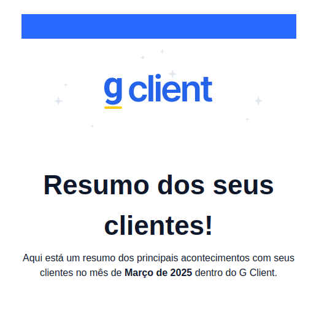

## Introdução

Dentro do **G Client**, alguns e-mails são enviados automaticamente. Atualmente, isso acontece em dois casos principais. Vem comigo que eu te mostro onde!

---

### 1. Quando o cliente é bloqueado

Sempre que a tag **bloqueado** é adicionada a um cliente, os responsáveis por ele recebem automaticamente um e-mail de notificação informando sobre essa mudança.

Essa funcionalidade é essencial para garantir que todos os responsáveis estejam atualizados sobre a situação do cliente.

---

### 2. Métricas mensais

No **dia 2 de cada mês**, os usuários com perfil de **administrador** recebem por e-mail um resumo com as principais métricas da empresa. Essas métricas incluem:

- Total de clientes ativos;
- Novos clientes;
- Clientes perdidos;
- Problemas registrados;
- Ocorrências registradas;
- Clientes em aviso;
- Clientes enviados para operação;
- Nota de **Health Score** do mês (caso esteja configurado).

---

✅ **Pronto!** Agora você entende como funcionam as notificações automáticas por e-mail no **G Client**. Se precisar de ajuda, entre em contato clicando [aqui](https://api.whatsapp.com/send?phone=5544997046569&text=Preciso%20de%20ajuda%20sobre%20um%20tutorial)!

🎉 **Obrigado por usar o G Client!**
