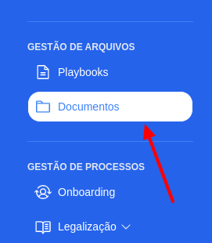
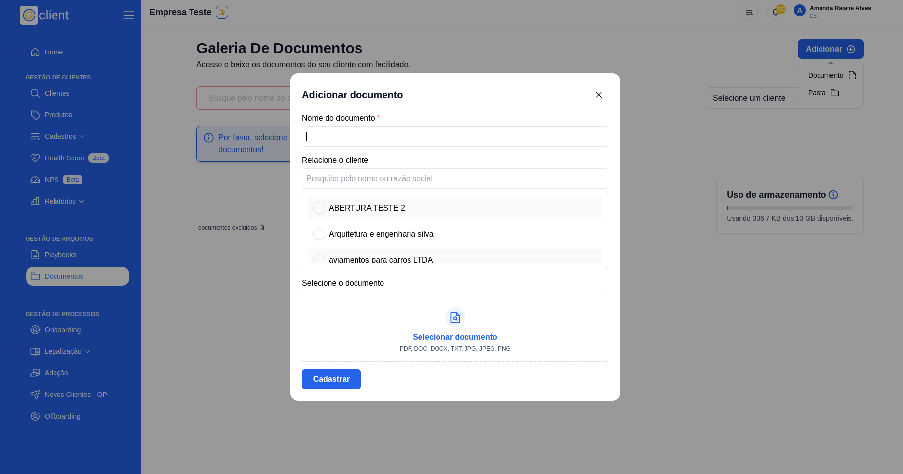
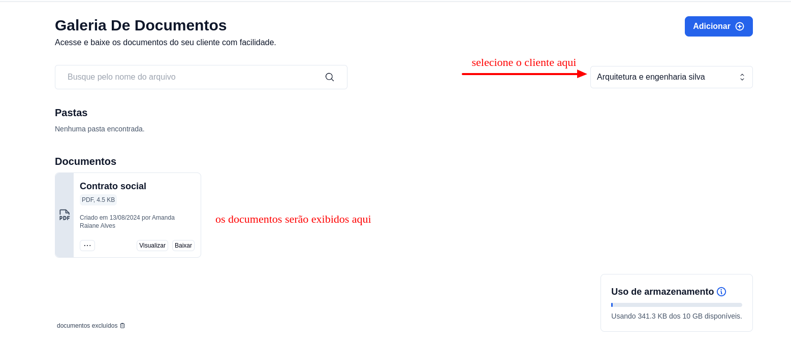
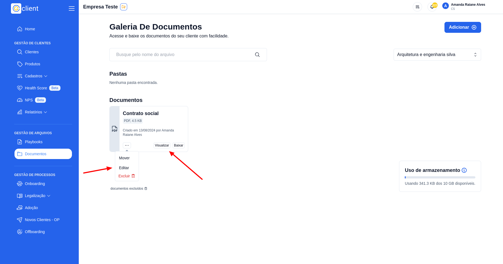
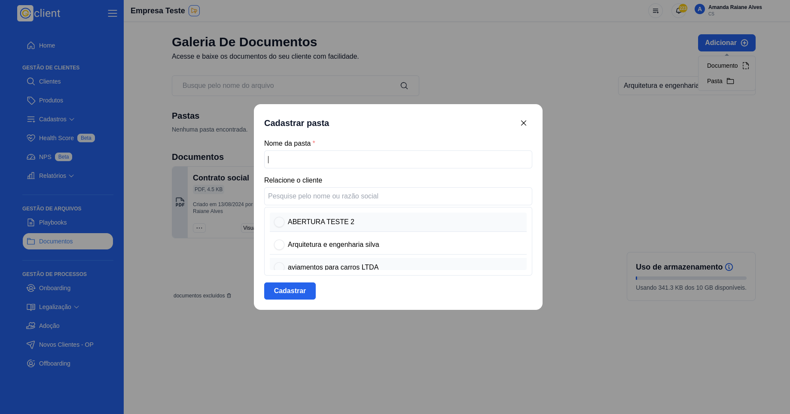
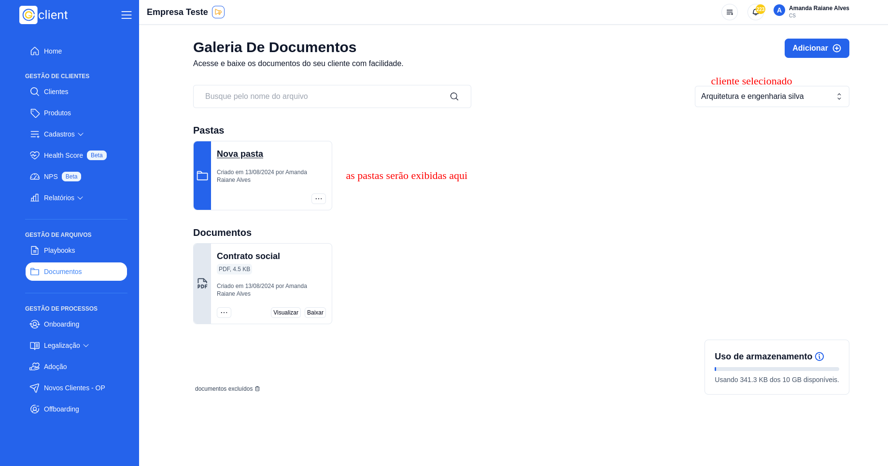
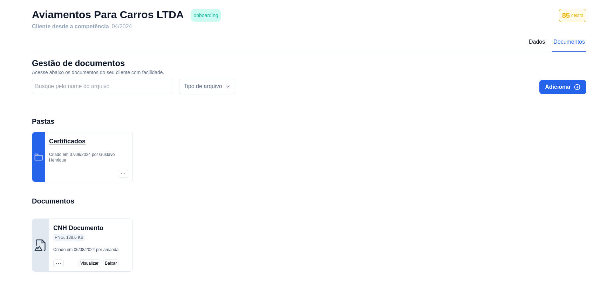

# 🗃️ Como armazenar documentos?

## Passo a Passo para armazenar documentos dos seus clientes

### 1. Acesse

Primeiramente, faça login na sua conta do G Client.

Verifique se você possui as permissões necessárias para lidar com os documentos.

### 2. Navegue até a Seção de GESTÃO DE ARQUIVOS

Clique na aba 📁Documentos localizada no menu lateral. Isso o levará para a página onde você pode visualizar a galeria de documentos.

### 3. Na galeria de documentos

Clique no botão `Adicionar +` escolha se deseja adicionar uma nova pasta ou um novo documento.

Escolhendo a opção **Documento**, será aberto um modal para adicionar as informações necessárias:

- Nome do documento
- Vincular o documento a um cliente
- Escolher o documento a ser inserido no sistema

Por fim, após preencher os campos basta clicar no botão **Cadastrar**

### 4. Selecione o cliente

Para visualizar o documento que você acabou de inserir, basta selecionar o cliente.

### 5. Botões de ação no documento

Cada documento irá conter os seguintes botões:

- `Visualizar`: ao clicar neste botão será aberto uma nova guia do navegador exibindo o conteúdo do documento.
- `Baixar`: ao clicar neste botão o documento será salvo em seu dispositivo.
- `...`: ao clicar nessa opção você visualizará 3 botões:
  - `Mover`: você poderá mover o documento para diferentes pastas.
  - `Editar`: você poderá editar o nome do documento.
  - `Excluir`: você poderá excluir um documento.

> ⚠️ Ao excluir um documento não será possível recuperar, a exclusão é permanente.

### 6. Criar pastas

Ainda na galeria de documentos, clique no botão `Adicionar +` escolha a opção **Pasta**.

Após será aberto um modal para adicionar as informações necessárias:

- Nome da pasta
- Vincular a pasta a um cliente

Por fim, após preencher os campos basta clicar no botão `Cadastrar`

Após o cadastro com exito, estando com o cliente selecionado você já verá a nova pasta criada.

Você também poderá: Mover, Editar ou Excluir uma pasta.

### 7. Página do cliente

Também é possível cadastrar e visualizar os documentos e pastas dentro da página do cliente.

Basta clicar na opção **_Documentos_**

Após clicar em **_Documentos_**

✅ Esse tutorial deve ajudar os usuários a cadastrar e visualizar os documentos dos seus clientes de forma simples e eficiente. Se precisar de mais alguma coisa, é só [avisar](https://api.whatsapp.com/send?phone=5544997046569&text=Preciso%20de%20ajuda%20sobre%20um%20tutorial)!
