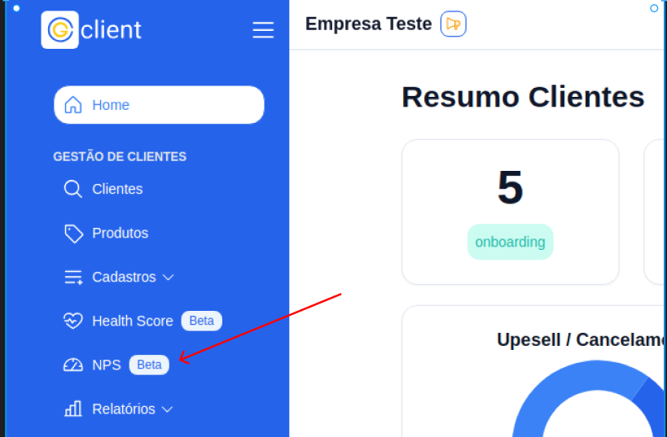
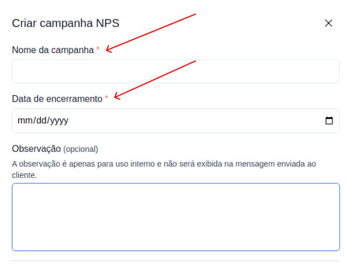
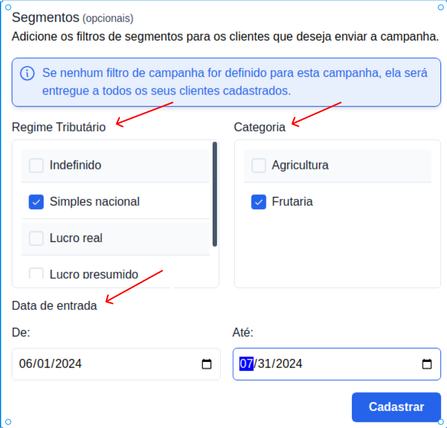

## Como criar pesquisas NPS

### 1. Acesse o G Client

Primeiramente, faça login na sua conta do G Client

### 2. Navegue até a pagina de NPS

Acesse a página de NPS localizada no menu lateral. Isso o levará para a página de configurações das pesquisas NPS.

### 3. Preecha as informações para criação da pesquisa NPS

Clique no botão Criar NPS e informe os campos obrigatórios que são:

- Nome da campanha
- Data de encerramento da pesquisa

Os demais campos apresentados no formulário são opcionais.

### Segmentos da pesquisa

No formulário de criação de pesquisa NPS, disponibilizamos filtros de segmentos. Esses filtros podem ser interessante caso queira segmentar o clientes que receberão essa pesquisa.

Dentro do segmentos temos três campos:

- Regime tributário
- Caategoria
- Data de entrada

> ℹ️ **Importante:** Caso queira que a campanha criada seja entregue a todos os seu clientes cadastrados na base, não é necessário preencher nenhum dos filtro de segmentos.

Ao terminar de preencher os campos e segmentos, basta clicar no botão Cadastrar para finalizar o cadastro da campanha.
