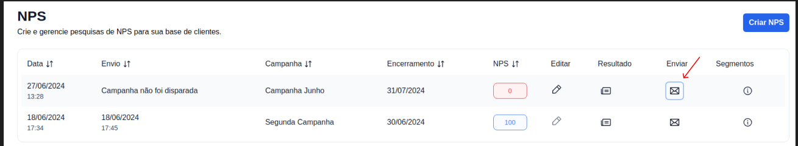
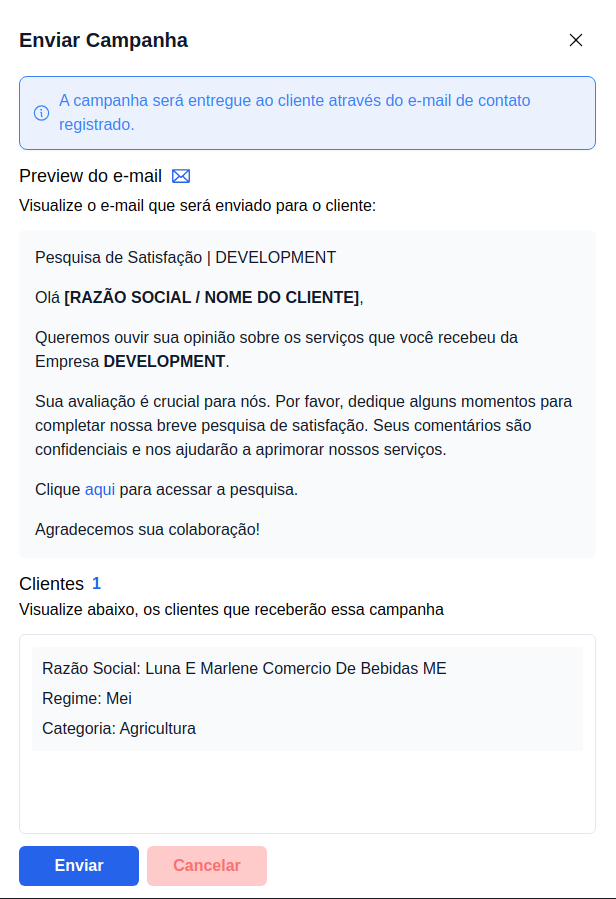

## Como enviar pesquisa NPS

### 1. Acesse o formulário de envio de pesquisa

Ainda na página de NPS, é possível visualizar a pesquisas criadas, clique botão correspondente ao título **Enviar**.

### 2. Preview do e-mail e clientes

Ao acessar o formulário de envio de pesquisa, é possível visualizar o preview do e-mail que será entregue aos clientes e também a quantidade e os clientes que receberão a campanha. Para efetuar o envio da campanha basta clicar no botão `Enviar`.

> ℹ️ **Importante:** A pesquisa NPS é entregue para o clientes atráves o email de contato do cliente cadastrado dentro do G Client, logo, é importante ter esse campo preenchido para garantir que o email da pesquisa seja entregue para o seus clientes.
